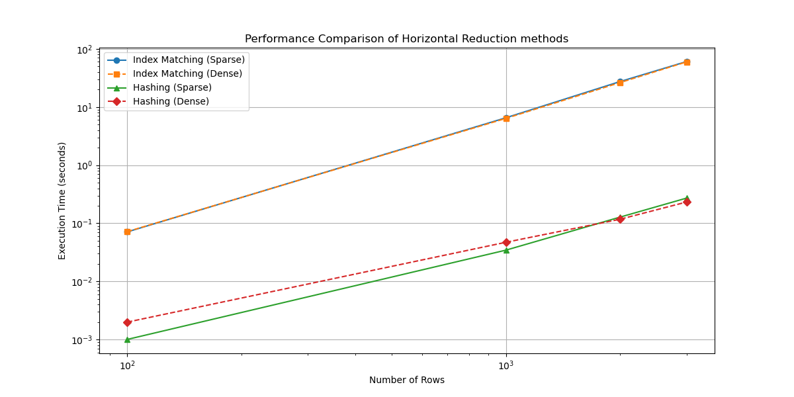
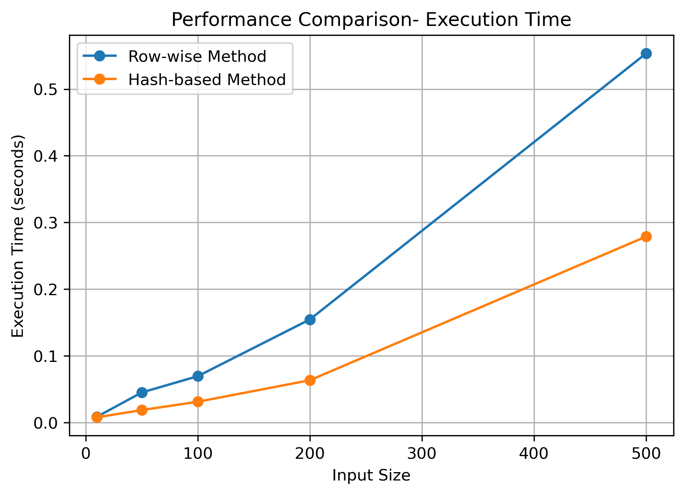
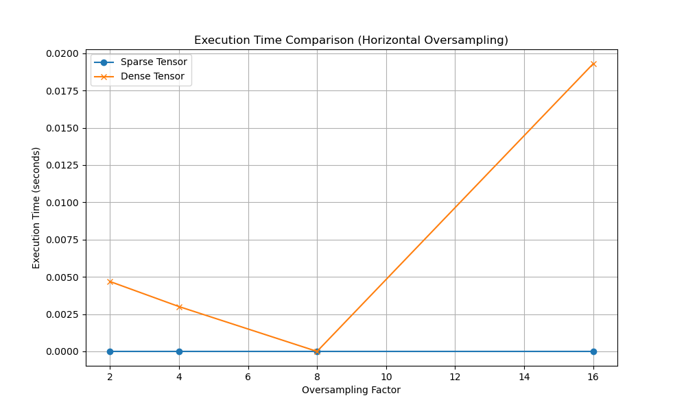
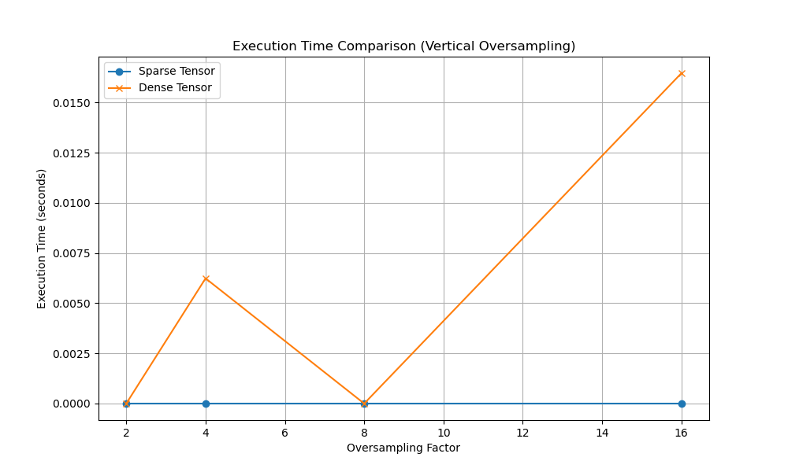
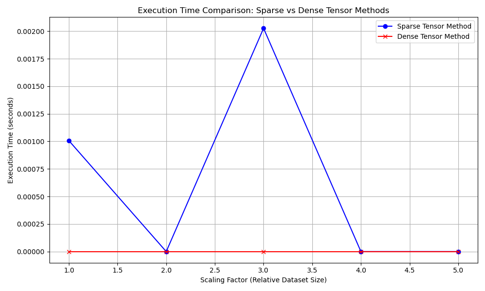

# TensorProv

Bibliothèque de méthodes permettant de trouver les tenseurs de provenance pour les opérations suivantes :  
- filter :  
	- horizontal reduction  
	- vertical reduction
- oversampling :
	- horizontal oversampling
	- vertical oversampling
- join
- union
  
## How to use

Create a **python 3.12.7** environment, and run :
```pip install -r requirements``` in a terminal open at the root of the project  

## Testing

In the **test** directory you'll find notebooks for testing the methods for each operation.  
You'll aslo find a **test_tensroprov.ipynb** notebook: Testing the Tensorprov class that englobes all the methods for all the operations.  

## Comparison plots

Filter:

  
Join:


Oversampling:

  
  

Union:
